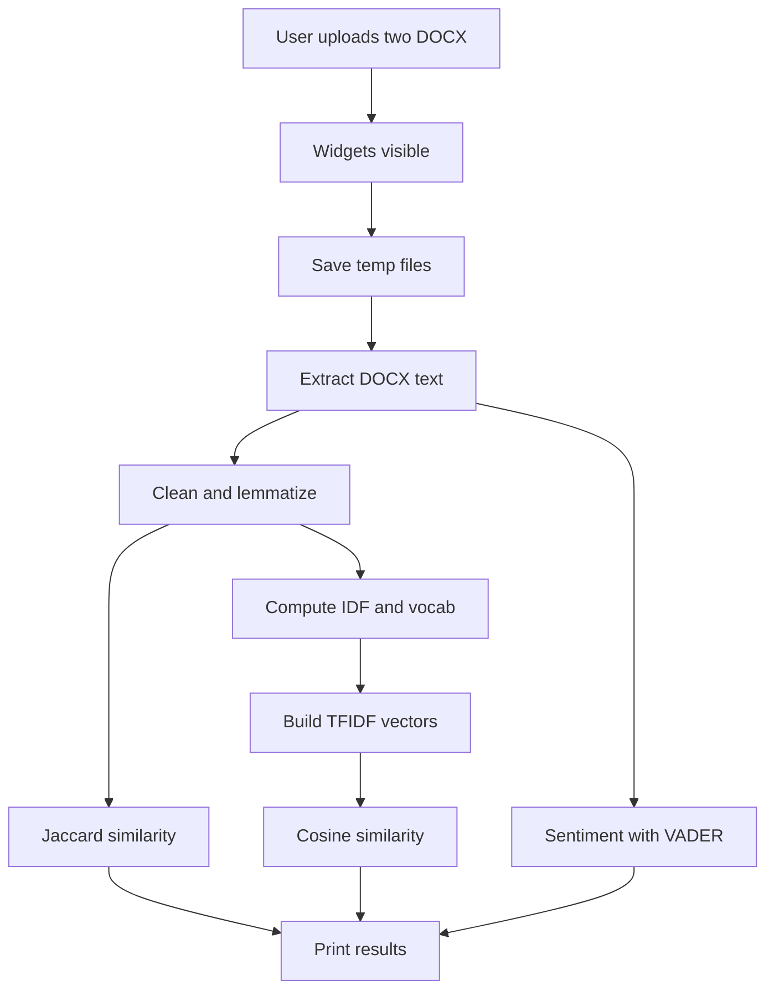
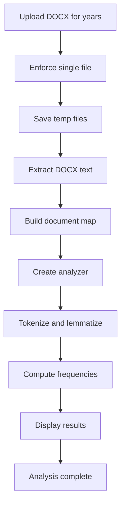

# Political Speech & Corpus Frequency Analysis 🔍

This project provides two Python tools for analyzing political speeches and document corpora.  
- **analysis.py** compares two speeches for sentiment and language similarity.  
- **frequency-analyzer.py** examines word frequency trends across multiple documents (1944–2024).

## Features
- Sentiment scoring with **VADER**  
- Vocabulary overlap via **Jaccard similarity**  
- Semantic divergence via **TF-IDF cosine similarity**  
- Corpus-wide frequency analysis across years  
- Interactive file uploads using **ipywidgets**

## Requirements
| Package             | Minimum Version |
|---------------------|-----------------|
| Python              | 3.7             |
| numpy               | 1.18            |
| spacy               | 2.3             |
| nltk                | 3.5             |
| ipywidgets          | 7.5             |
| (docx files)        | .docx           |

## Installation ⚙️
1. Clone this repository.  
2. Create a virtual environment:
   ```bash
   python -m venv venv
   source venv/bin/activate      # macOS/Linux
   venv\Scripts\activate.bat     # Windows
   ```
3. Install dependencies:
   ```bash
   pip install numpy spacy nltk ipywidgets
   ```
4. Download language models and lexicons:
   ```bash
   python -m spacy download en_core_web_md
   python
   >>> import nltk
   >>> nltk.download('vader_lexicon')
   >>> exit()
   ```

## Configuration
- Ensure **ipywidgets** works in Google Colab:
  ```bash
  pip install ipywidgets
  ```
- Place speech documents in **.docx** format.
- No extra configuration needed.

## Usage

### 1. Political Speech Comparison (analysis.py)
This script runs in Google Colab.

1. Open Google Colab:
   ```bash
   # Open https://colab.research.google.com
   ```
2. In a new cell, load and run:
   ```python
   %run analysis.py
   ```
3. Upload two `.docx` speeches via the displayed widgets:
   - **Democrat Speech**  
   - **Republican Speech**
4. View metrics:
   - Jaccard similarity (vocabulary overlap)  
   - Cosine similarity (semantic divergence)  
   - VADER sentiment scores


### 2. Corpus Frequency Analysis (frequency-analyzer.py)
This tool compares word usage across election-year speeches.

1. In Google Colab, run:
   ```python
   %run frequency-analyzer.py
   ```
2. Upload speeches for any years (1944–2024) for **R** or **D** labels.  
3. Click **ANALYZE CORPUS**.  
4. Review results:
   - Most common word overall  
   - Frequency breakdown per document  
   - Top 10 corpus lemmas


## Common Use Cases
- Compare political rhetoric between two candidates.  
- Track term usage changes over decades.  
- Perform sentiment analysis on policy speeches.  
- Identify topic shifts across election cycles.

## Troubleshooting
- **SpaCy model error**: run `python -m spacy download en_core_web_md`.  
- **Empty output**: ensure DOCX files contain text.  
- **Widget not displaying**: install `ipywidgets` in Google Colab and restart runtime.

---

Enjoy exploring political language dynamics!